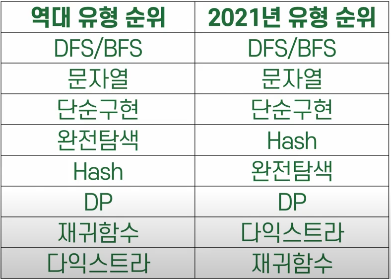

# 역대 출제 유형

1. DFS/BFS
2. 문자열
3. 단순구현
4. 완전탐색
5. 해시

위 5가지 유형이 75%이다.

---
6. DP
7. 재귀
8. 다익스트라

위 3가지 유형이 10%

상위 5가지를 깊게 공부하는게 효율적이다.
안전빵으로 가려면 dp, 재귀, 다익스트라 까지 공부

---

문제 유형은 사실상 정해져 있다.

출처 : https://www.youtube.com/watch?v=mIf-ZqfK4EA (3:02)
